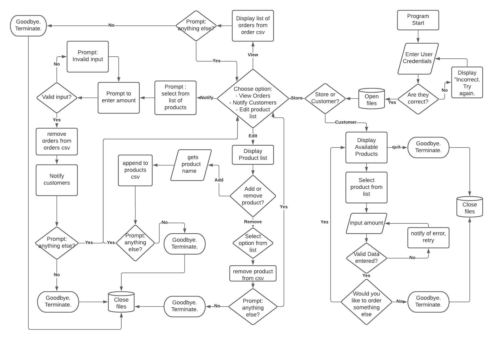

## R4 - link to GitHub:
https://github.com/JCBSLMN/T1A3

# Notifier app Software Development Plan
## R5 - Statement of purpose:
---
### What the application will do -
The application is designed to allow easy ordering of product for customers and easy notifcation for the client. Customers are able to place orders for products and be notified once the product has arrived and is ready for pick up. The application will automatically notify the right number of people once delivery data has been entered into the app, and remove orders automatically. Permissions will be split between two classes, with customers only being able to see what products are available and make an order, and the store being able to see what orders have been made and also make modifications to the available item list.

As application is in beta user verification has not been completed for ease of testing.

### The problem it will solve and explain why you are developing it -
I currently interact with a business that requires me to place orders for product by calling them, and once the product has been delivered to the store they must call me to notify me it has arrived. 

The store is very busy and it is hard to get through on the phone, which is a waste of my time, and they have to call the customers once the orders have arrived which is a waste of their time and can be unreliable, what if they miss a number? Wouldn't it be great if nobody had to waste their time and customers could be notified reliably?

I am developing this application to save both the customer and business time as well as prevent any human error in the notification process. 

### The target audience -
The taget audience is the store and other like it as they are the ones that will be paying for the software. Both the store and the stores customer base are the end users of the application.

### How a member of the target audience will use it -
The target audience will use the application on a daily basis to see what orders have come in and see what they must get delivered. Once a delivery has arrived they are able to input this into the app and the app will notify customers that they can come in to pick up the product.

---
## R6 - List of features that will be included in the application:
---

Customers:
- See what products are available to order
- Place an order for a particular product

Store:
- See what orders have come in
- Enter delivery data to notify customers
- Edit list of products that are avaialble
---
## R7 - Outline of the user interaction and experience for the application:
---
### How the user will find out how to interact with / use each feature -
A -h option will be available to users as well as accompanied help information in the README. 

### How the user will interact with / use each feature -
Customers:
Customers will enter credentials to allow them access to the app. They will be displayed a list of all available products to them using TTY-prompt and be able to select and option. Once an option has been selected they are able to enter their name and email/sms using 'gets' to be contacted on.

Store:
The store user will be diplayed 3 options using TTY-prompt, 'View Orders', 'Notify Customers', 'Edit Product List'

If they select 'View orders it will display them a list of current orders.

Selecting 'Notify Customers' will prompt user to select what product arrived and enter how many of the product were delivered/made.

'Edit Product List' will allow users to select between adding or removing an item. If removing an option they will be prompted to select what item, and if adding an item they will be prompted to enter product name with 'gets'

### How errors will be handled by the application and displayed to the user -
Ideally i will have error control throught the code with any incorrect inputs displaying a message to instruct on what the correct input should be.

---
## R8 - Diagram of the control flow of your application:
---

---
## R9 - Implementation plan:
---
https://trello.com/b/rbeskEqR/notifier
---
## R10 - Help documentation:
---
### Steps to install the application -
This application can be downloaded from GitHub. Once you have downloaded you branch and navigated to the folder, the file can be run from the terminal with the insturction 'ruby main.rb' if you'd prefer to install all required gems yourself. These can be found listed in the dependencies below.

Arguements can be passed when running the file:
- Passing '-h' or '--help' following 'ruby main.rb' will display a help menu.
- Passing '-s' will open in store mode
- Passing '-c' will open in customer mode

An exectubale has been made that can install the require gems for you. This can be run once you have navigated to the correct folder and can be run with the command './run_file.sh'

### Any dependencies required by the application to operate -
#### gems -
- tty, ~> 0.7.0
- rspec, ~> 3.9
- tty-prompt, ~> 0.12.0
- colorize, ~> 0.8.1
- mail, ~> 2.7
- tty-spinner, ~> 0.4.1

#### ruby -
ruby 2.6.3p62

### Any system/hardware requirements -
#### OS - 
- Only tested on macOS Catalina Version 10.15.6. May not be compatible on other OS.

#### minimum harware requirements:
- 8 MHz 68000 processor 
- 128k of RAM 
- and a 400k disk drive
---